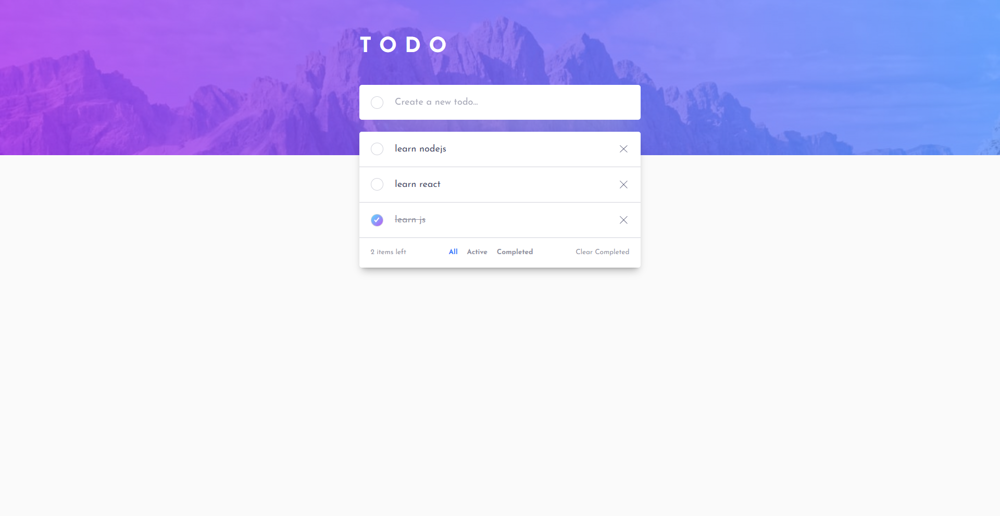

# 📝 To-Do App  

Aplicación de lista de tareas (*To-Do*) basada en el desafío de [Frontend Mentor](https://www.frontendmentor.io/challenges/todo-app-Su1_KokOW). Permite gestionar tareas diarias con filtros, persistencia en el navegador y un diseño responsive.  

🔗 [Demo en vivo](https://jorge-castillo-l.github.io/todo-app/)  

---

## 🚀 Características
- ➕ Añadir nuevas tareas  
- ✅ Marcar y desmarcar como completadas  
- 🗑️ Eliminar tareas individuales  
- 📂 Filtros: *All*, *Active*, *Completed* (sincronizados en móvil y escritorio)  
- ♻️ Limpiar todas las completadas de una vez  
- 💾 Persistencia con **localStorage**  
- 🎨 Diseño responsivo y preparado para *dark mode*  

---

## 🛠️ Tecnologías usadas
- **HTML5 semántico**  
- **CSS3** con variables y media queries para responsive  
- **JavaScript Vanilla (ES6+)** con manipulación del DOM, delegación de eventos y localStorage  

---

## 📸 Captura
 

---

## ⚙️ Instalación y uso
Clona el repositorio e inicia el proyecto localmente:  

git clone https://github.com/jorge-castillo-l/todo-app.git
cd todo-app
open index.html

O ábrelo directamente desde la [demo en GitHub Pages](https://jorge-castillo-l.github.io/todo-app/).

---

## 📚 Aprendizajes clave
- Manejo de **eventos delegados** para botones de eliminar y completar.  
- Sincronización de filtros en interfaces *desktop* y *mobile*.  
- Persistencia de datos usando `localStorage` con validaciones.  
- Uso de **funciones modulares** para mantener el código organizado.  

---

## 🔮 Próximos pasos
- 🧩 **Drag & Drop** para reordenar tareas con **persistencia** del nuevo orden.  
- ✏️ **Edición inline** de tareas (Enter para guardar, Esc para cancelar).  
- ♿ **Accesibilidad**: roles/atributos ARIA, foco visible y navegación completa con teclado (Tab/Enter/Espacio).  
- 🌗 **Toggle de modo oscuro** funcional (guardar preferencia en `localStorage`).  
- ✅ **Testing**: pruebas unitarias con **Jest** (lógica de filtros y contador), y (opcional) E2E con Playwright.  
- 🧱 **Refactor a módulos ES** (`import/export`) para separar lógica (storage, filtros, UI).  
- 🧼 **Limpieza y documentación**: comentarios clave, README con GIF de uso y sección de troubleshooting.  

---

## 👤 Créditos
Desafío original de [Frontend Mentor](https://www.frontendmentor.io/challenges/todo-app-Su1_KokOW).  
Desarrollado por [Jorge Castillo](https://github.com/jorge-castillo-l).
